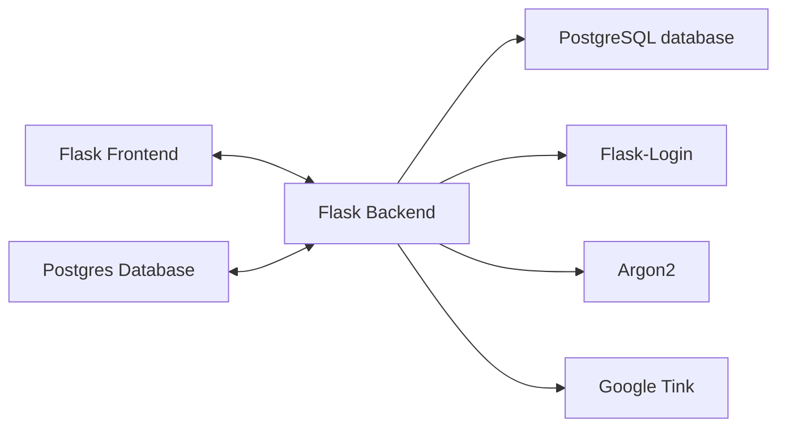

<div style="display: flex; justify-content: center; align-items: center; width: 500px; margin: 0 auto;">
    
    
    <div style="padding: 20px; text-align: center;">
        <h3 style="font-size: 16px;">Project CryptoGraphie part 2</h3>
        <h3 style="font-size: 16px;">Guillaume Dorschner & Jules Deleuse</h3>
        <h3 style="font-size: 16px;">A4 - CCC</h3>
    </div>
    
</div>

# Introduction

This project is a comprehensive exploration of cryptographic principles and their application in securing user data. Through a two-part implementation focusing on **password storage** and **Password-Authenticated Key Exchange (PAKE)**, this project demonstrates robust security practices in application development.


# Project Implementation

The second part of your project involves Password-Authenticated Key Exchange (PAKE), focusing on securely authenticating users without transmitting passwords in cleartext, even without an encrypted channel. This part delves into Asymmetric PAKE, a method to store user secrets on a server without giving the server access to those secrets. It employs a cryptographic exchange allowing the server to store a "locked" secret envelope, which the user can unlock using their password and a server-known secret key. The process involves Oblivious Pseudo-Random Functions (OPRF) for secure exchanges and outlines steps for registration and login phases, emphasizing the importance of not revealing any additional information beyond whether the password matches the expected value.

# Getting Started

## Installation

We use docker to run the application for simplicity. You can install docker from [here](https://docs.docker.com/get-docker/).

1. Download docker on your computer
2. Download the [release](https://github.com/GuillaumeDorschner/ESILV-Cryptography-S8/releases/latest) of the project
3. Change the example.env to .env and fill in the environment variables. Then run the following command to start the application:

```bash
docker compose up
```

# What we will be using

All the code is written in Python, and we will be using the following libraries:
- [Flask](https://flask.palletsprojects.com/en/3.0.x/)
- [PostgreSQL database](https://www.postgresql.org/)
- [Flask-Login](https://flask-login.readthedocs.io/en/latest/)
- [Argon2](https://en.wikipedia.org/wiki/Argon2)
- [Google Tink](https://developers.google.com/tink) for all cryptographic operations.



# Diagrams and Explanations

Example of Sequence Diagram.

### First part of the project: Password storage

1. Sign up
    ```mermaid
    sequenceDiagram
        User->>Server: Hello I want to signup I'm Bob with password "1234"
        Server-->>Server: Hash the password with salt
        Server-->>Database: Store: hashed password & salt
        Server-->>Server: Generate a session token
        Server-->>Database: Store: session token
        Server-->>User: Welcome Bob | send the session token
    ```
2. Log in
    ```mermaid
    sequenceDiagram
        User->>Server: Hello, I'm Bob with password "1234"
        Server-->>Database: Retrieve: hashed password & salt
        Server-->>Server: Hash the password with the retrieved salt
        Server-->>Server: Compare the hashed password with the one in the database
        Server-->>Database: Generate a session token
        Server-->>User: Welcome Bob | send the session token
    ```

### Second Part of the Project: PAKE

1. Registration with PAKE
    ```mermaid
    sequenceDiagram
        User->>Server: Initiate signup with username "Bob"
        User->>Server: Perform OPRF with password "1234"
        Server-->>User: Respond with OPRF result, storing public key
        User-->>User: Generate private/public key pair
        User-->>Server: Send encrypted envelope with public key
        Server-->>Database: Store user's OPRF key, public key, and encrypted envelope
    ```
2. Login with PAKE
    ```mermaid
    sequenceDiagram
        User->>Server: Initiate login with username "Bob"
        User->>Server: Perform OPRF with password "1234"
        Server-->>Database: Retrieve OPRF key, public key, and encrypted envelope
        Server-->>User: Send OPRF result and encrypted envelope
        User-->>User: Decrypt envelope, retrieve keys
        User->>Server: Start AKE protocol with server, establish shared secret
        Server-->>User: Confirm login, generate session token
    ```

